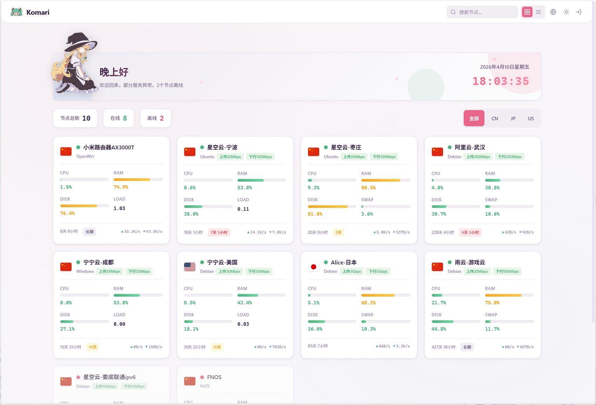
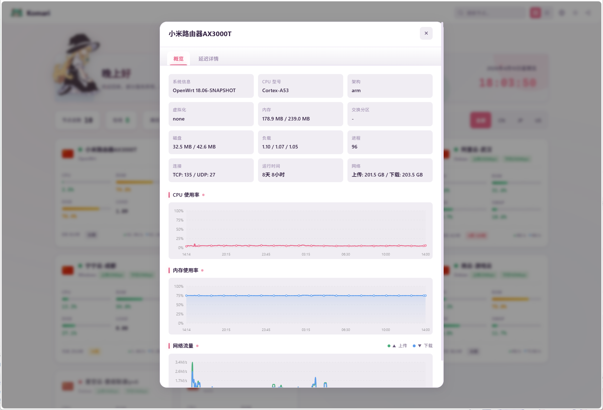
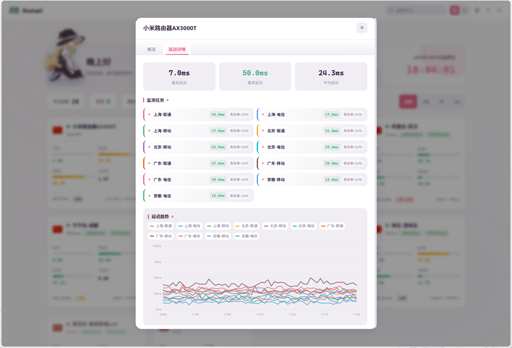

## 项目地址
::github{repo="mikus-loli/komari-mikus"}

## 特性

- 🎨 **双主题支持** - 浅色/深色主题无缝切换，支持跟随系统
- 📊 **双视图模式** - 网格视图和表格视图自由切换
- 🌐 **多语言支持** - 内置中英文切换
- 📡 **WebSocket 实时监控** - 实时数据更新
- 📱 **响应式设计** - 完美适配各种设备
- 🏳️ **国旗图标** - 支持全球国家和地区旗帜显示


## 安装

1. 从 [Releases](https://github.com/mikus-loli/komari-mikus/releases) 页面下载最新版本的 ZIP 文件
2. 上传到 Komari 主题
3. 在 Komari 配置中选择 komari-mikus 主题

## 项目结构

```
komari-mikus/
├── .github/
│   └── workflows/
│       └── release.yml      # GitHub Actions 工作流
├── dist/
│   ├── assets/
│   │   ├── flags/           # 国旗图标
│   │   ├── img/             # 图片资源
│   │   ├── app.js           # 应用脚本
│   │   └── style.css        # 样式文件
│   └── index.html           # 主页面
├── komari-theme.json        # 主题配置
└── README.md
```
## 预览




