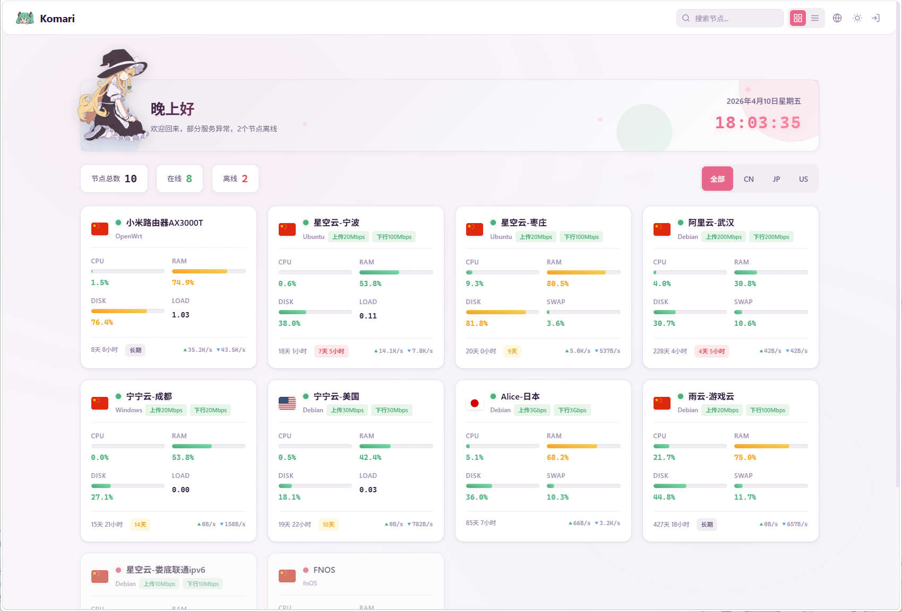
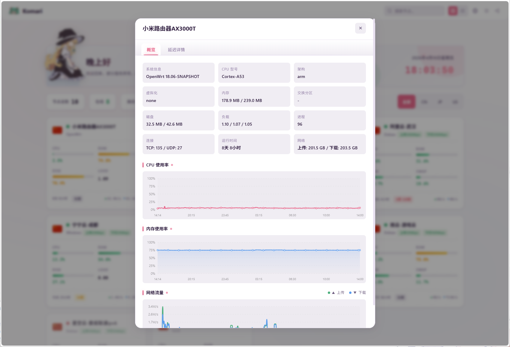
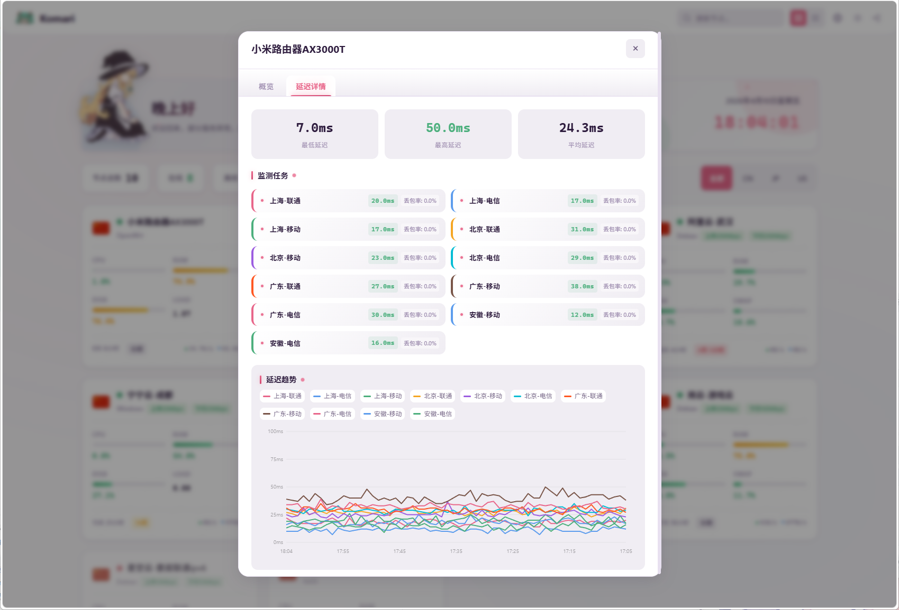

## 项目地址
::github{repo="mikus-loli/komari-mikus"}

## 特性

- 🎨 **双主题支持** — 浅色/深色主题无缝切换，支持跟随系统，40+ CSS 自定义属性精细调色
- 📊 **双视图模式** — 网格视图和表格视图自由切换，支持分组过滤和搜索
- 🌐 **多语言支持** — 内置中/英文界面切换，60+ 翻译词条覆盖全界面
- 📡 **WebSocket + HTTP 双通道** — 实时数据推送，自动 fallback 与指数退避重连
- 📱 **响应式设计** — 完美适配各种设备，PWA 友好的 meta 标签
- 🏳️ **国旗图标** — 支持 270+ 国家和地区旗帜显示
- 📈 **Canvas 图表系统** — 配置驱动的 CPU/内存/网络/磁盘/进程/延迟图表，IntersectionObserver 懒加载
- 🔬 **数据处理管道** — EWMA 平滑、LTTB 降采样、线性插值、峰值抑制，时序数据保真度优先
- 🧪 **自动化测试** — 算法单元测试 + API/RPC 测试，CI 流程自动校验
- 🌸 **樱花飘落** — 可开关的 Canvas 动画背景效果

## 安装

1. 从 [Releases](https://github.com/mikus-loli/komari-mikus/releases) 页面下载最新版本的 ZIP 文件
2. 上传到 Komari 主题设置
3. 在 Komari 配置中选择 komari-mikus 主题

## 项目结构

```
komari-mikus/
├── .github/workflows/
│   ├── test.yml              # CI：算法测试 + API 测试 + 代码风格校验
│   └── release.yml           # CD：tag 触发自动打包 + GitHub Release
├── dist/
│   ├── assets/
│   │   ├── css/              # 8 个模块化 CSS 文件（base/header/welcome/stats/nodes/modal/footer/preloader）
│   │   ├── flags/            # 271 面国旗 SVG
│   │   ├── img/              # 图片资源（logo、加载动画、背景）
│   │   ├── js/
│   │   │   ├── core/         # 状态管理、常量、错误边界
│   │   │   ├── services/     # RPC 客户端、API 层、实时数据流
│   │   │   ├── ui/           # 节点渲染、图表 Canvas、模态框、主题、预加载
│   │   │   ├── utils/        # 颜色、格式化、时间、通用辅助
│   │   │   ├── algorithms/   # EWMA/LTTB/插值/峰值检测算法库
│   │   │   ├── i18n/         # 国际化字典
│   │   │   └── app.js        # 应用主入口（初始化编排）
│   │   └── style.css         # 入口样式（已拆分到 css/）
│   └── index.html
├── test/                     # 单元测试
│   ├── algorithms.test.mjs   # 算法测试（40+ 用例）
│   └── api-rpc.test.mjs      # API/RPC 测试
├── komari-theme.json         # 主题配置（15 个可配置项）
└── README.md
```

## 架构亮点

### 纯 ES Modules，零构建

整个项目没有 Webpack/Vite——就是原生 ES Module 在浏览器里直接跑。所有的 import/export 都是标准 ESM 语法，`index.html` 只需要一个 `<script type="module" src="assets/js/app.js">`。这对于 Komari 主题这种「下载 zip → 解压到主题目录」的分发场景来说，反而比上构建工具更合适。

### 模块分层

```
app.js (编排层)
  ├── core/       (状态、常量、错误边界)
  ├── services/   (RPC、API 调用、实时数据)
  ├── ui/         (DOM 渲染、Canvas 图表、主题)
  ├── algorithms/ (数据处理算法)
  └── utils/      (工具函数)
```

`app.js` 作为主入口不直接渲染任何东西，它只负责编排初始化流程：错误边界 → 预加载器 → 时间更新 → RPC 连接 → 配置加载 → 主题初始化 → 节点渲染 → 事件绑定 → 图表绘制。每一步之间有明确依赖关系，通过 Promise chain 串联。

### RPC 客户端

`RPC2Client` 类实现了一套完整的 JSON-RPC 2.0 通信层：
- **WebSocket 主通道** — 实时数据推送
- **HTTP long-polling 兜底** — WebSocket 不可用时自动降级
- **指数退避重连** — 1s → 2s → 4s → ... → 30s cap，避免 reconnect storm
- **请求超时控制** — 超时后自动切换到 HTTP fallback
- **并发调用管理** — 基于 `pendingCalls` Map 跟踪所有进行中的 RPC 调用

### 数据处理管道

监控数据的核心挑战是时序数据的质量。这里实现了一套完整的处理流水线：

1. **时间序列规整** — 将不规则采样的记录对齐到均匀时间网格
2. **缺失值填充** — 基于 nullTemplate 的模式填充，避免图表断线
3. **线性插值** — 对短时间间隔内的 null 值做线性插值
4. **EWMA 平滑** — 指数加权移动平均，过滤瞬时抖动
5. **LTTB 降采样** — Largest Triangle Three Buckets 算法，在保留趋势的前提下大幅减少绘制点数
6. **峰值抑制** — 检测并削平异常突变尖峰

### Canvas 图表引擎

图表模块值得单独说一下。采用配置驱动模式：

```js
const config = {
  canvasId: 'cpuChart',
  padding: { top: 24, right: 20, bottom: 32, left: 50 },
  timeRange: '1h',
  // ...
};
renderChartByConfig(config, records, hours);
```

支持 DPR 自适应（`devicePixelRatio`），在 Retina 屏上保证清晰度。使用 IntersectionObserver 实现懒加载——只有图表进入视口时才渲染，避免一次性渲染多个图表造成卡顿。

## 工程实践

### CI/CD

两个 GitHub Actions 工作流：

- **Test**（push/PR 触发）：跑全部算法测试 + API 测试 + 校验 `var` 零使用 + 检查关键文件完整性
- **Release**（tag 触发 / 手动 dispatch）：更新版本号 → 打包 zip → 生成 release notes（自动提取 commit log）→ 发布 GitHub Release → 上传构建产物

测试覆盖了 40+ 用例，包括边界情况（null/NaN 输入、空数组、单一元素、恒定值、大数组降采样）和浮点精度断言（`approxEq`），不是那种只跑 happy path 的摆设测试。

### 代码质量

- 零 `var` 声明（CI 中强制校验，`sakura.js` 除外）
- 所有模块有统一的 JSDoc 头部标注
- 全局 ErrorBoundary 捕获未处理的 Promise rejection 和运行时错误，Toast 提示用户

### 主题配置

`komari-theme.json` 定义了 15 个可配置项，涵盖外观（默认主题/视图）、显示项（运行时间/网速/Ping/连接数）、特效（樱花/图标跳动/预加载动画/吉祥物）、自定义背景（PC/手机端分别设置）和页脚。每个配置项都有完整的中/英/日（配置标签）翻译和帮助说明。

## 一些可以改进的地方

套用一句评价：**骨骼清奇，底子极好，细节还需打磨。**

- 有几个模块偏大（`nodes.js` 662 行、`modal.js` 599 行），后续可以按职责拆分
- `utils/helpers.js` 是个 20 个导出函数的工具集合，可以考虑分类
- 日语的界面翻译还没完成，虽然有配置标签翻译但字典还没写
- 国旗 SVG 有 271 个文件（~2MB），可以考虑按需加载或换用 CSS flag library
- 图表/UI 部分还没有自动化测试，主要靠手动验证

## 预览





