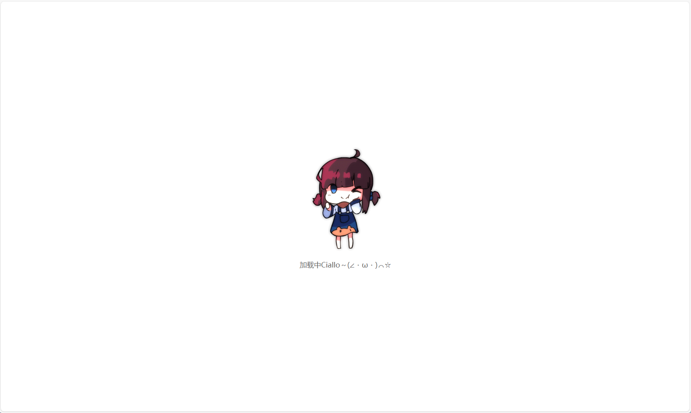
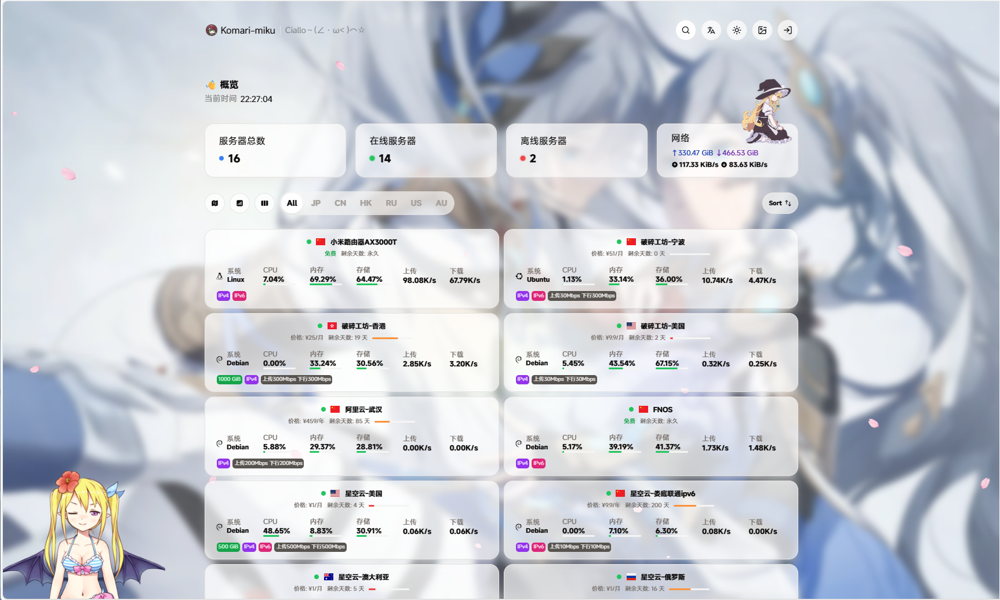

# Komari-Nezha-V1 主题美化

## 原项目
::github{repo="Akizon77/nezha-dash-v1"}
感谢 *Akizon77* 大佬的移植 和 *まも* 大佬的美化\
mikus在 *まも* 大佬的基础上进行了一些修改，添加了一些新的功能
## 美化内容
### 1. 樱花飘落特效
```html
<script type="text/javascript" src="https://static.mikus.ink/%E6%A8%B1%E8%8A%B1/sakura.js"></script>
```
### 2. 预加载动画
```html
<style>
    /* 预加载动画容器：全屏覆盖，居中显示（完全保留你的原始样式） */
    .preloader {
      position: fixed;
      top: 0;
      left: 0;
      width: 100%;
      height: 100%;
      background: #fff; /* 背景色，与页面背景协调 */
      display: flex;
      justify-content: center;
      align-items: center;
      z-index: 9999; /* 确保在最上层 */
      transition: opacity 0.5s ease; /* 消失时的过渡效果 */
      flex-direction: column; /* 新增：让动图和文字垂直排列 */
    }

    /* 动图容器：替换原有的圆形旋转样式，仅控制动图尺寸 */
    .preloader-gif {
      width: 200px; /* 可根据动图比例调整，避免拉伸 */
      height: auto; /* 保持动图原有宽高比 */
    }

    /* 加载文字样式：新增，仅控制文字外观 */
    .preloader-text {
      margin-top: 20px; /* 与动图保持间距 */
      font-size: 18px; /* 文字大小 */
      color: #666; /* 文字颜色，可根据背景调整 */
      font-family: "Microsoft YaHei", sans-serif; /* 字体 */
    }

    /* 页面加载完成后，隐藏预加载动画（完全保留你的原始样式） */
    .preloader.hidden {
      opacity: 0;
      pointer-events: none; /* 隐藏后不响应鼠标事件 */
    }
</style>

<!-- 预加载容器：添加文字提示，与动图垂直排列 -->
<div class="preloader">
  
  <div class="preloader-text">加载中Ciallo～(∠・ω・)⌒☆</div> <!-- 新增：加载提示文字 -->
</div>

<script>
  // 设置的2.1秒自动结束
  setTimeout(() => {
    document.querySelector('.preloader').classList.add('hidden');
  }, 2100);
</script>

    <script>
      // 在页面渲染前就执行主题初始化
      try {
        const storageKey = "vite-ui-theme"
        let theme = localStorage.getItem(storageKey)
        if (theme === "system" || !theme) {
          theme = window.matchMedia("(prefers-color-scheme: dark)").matches ? "dark" : "light"
        }
        document.documentElement.classList.add(theme)
      } catch (e) {
        document.documentElement.classList.add("light")
      }
    </script>
```
### 3. 自定义鼠标指针
```html
<!-- 网站指针 -->
<style>
  /* 1. 覆盖所有元素，最高优先级 */
  * {
    /* 顺序：自定义光标 -> 备用光标（pointer/default 适配不同场景） */
    cursor: url(https://easyimage.mikus.ink/i/u/2026/01/17/lk6r0.webp
) 0 0, pointer !important;
    /* 补充：若图片是.ico格式，可直接用；png需确保浏览器支持（现代浏览器都支持） */
  }

  /* 2. 单独强化交互元素（双重保险） */
  body, button, a, input, select, textarea, 
  .btn, [role="button"], [type="button"], [type="submit"] {
    cursor: url(https://easyimage.mikus.ink/i/u/2026/01/17/lk6r0.webp
) 0 0, pointer !important;
  }

  /* 3. 解决hover/focus状态下的样式覆盖 */
  a:hover, a:focus,
  button:hover, button:focus,
  .btn:hover, .btn:focus {
    cursor: url(https://easyimage.mikus.ink/i/u/2026/01/17/lk6r0.webp
) 0 0, pointer !important;
  }
</style>
```
### 4. 添加live2d
```html
    <!-- waifu-tips.js 依赖 JQuery 库 -->
    <script src="https://static.mikus.ink/live2d/jquery.min.js"></script>
    <!-- 使用 aotuload.js 引入看板娘 -->
    <script src="https://static.mikus.ink/live2d/autoload.js"></script>
```

### 5. 哪吒主题美化
```html
    <script>
      // 移除GPU卡片
      ;(function () {
        "use strict"

        const containerSelector =
          "#root > div > main > div.mx-auto.w-full.max-w-5xl.px-0.flex.flex-col.gap-4.server-info > div:nth-child(3) > section > div:nth-child(2)"
        const pRelativeSelector = "div > section > div.flex.items-center.justify-between > section.flex.flex-col.items-center.gap-2 > p"
        
        const TAG = "[remove-gpu-if-present]"

        function processOne(container) {
          try {
            if (!container) return false
            const p = container.querySelector(pRelativeSelector) || container.querySelector("p")
            if (!p) {
              return false
            }
            const text = (p.textContent || "").trim()
            //console.info(TAG, "找到 <p> 文本：", text)
            if (/gpu/i.test(text)) {
              console.info(TAG, '匹配到 "GPU"，将删除容器：', container)
              container.remove()
              return true
            }
            return false
          } catch (err) {
            //console.error(TAG, "处理容器时出错：", err)
            return false
          }
        }

        function findAndProcess() {
          try {
            const container = document.querySelector(containerSelector)
            if (!container) {
              // not found
              return false
            }
            return processOne(container)
          } catch (err) {
            return false
          }
        }

        // 1) 尝试一次性查找（页面可能已加载）
        findAndProcess()

        // 2) 使用 MutationObserver 监视 body 的变化（在单页应用中非常有用）
        const mo = new MutationObserver((mutations) => {
          // 尽量快速返回以降低开销
          if (findAndProcess()) {
            // 删除成功后可以选择断开 observer（如果只想处理一次）
            // mo.disconnect();
          }
        })
        mo.observe(document.body, { childList: true, subtree: true })

        // 3) 监听单页应用的路由变化（覆盖 pushState/replaceState 并监听 popstate）
        ;  // 3) 监听单页应用的路由变化（覆盖 pushState/replaceState 并监听 popstate）
  (function hijackHistoryEvents() {
    try {
      const originalPush = history.pushState;
      const originalReplace = history.replaceState;
      history.pushState = function() {
        const ret = originalPush.apply(this, arguments);
        window.dispatchEvent(new Event('locationchange'));
        return ret;
      };
      history.replaceState = function() {
        const ret = originalReplace.apply(this, arguments);
        window.dispatchEvent(new Event('locationchange'));
        return ret;
      };
      window.addEventListener('popstate', function() {
        window.dispatchEvent(new Event('locationchange'));
      });
      window.addEventListener('locationchange', function() {
        // 微延时，让框架先渲染 DOM
        setTimeout(findAndProcess, 150);
      });
    } catch (err) {
      console.warn(TAG, 'hook history 失败（可以忽略，非必需）', err);
    }
  })();

  // 4) 额外的轮询保险（如果 MutationObserver 未捕获到）
  const maxTries = 30;
  let tries = 0;
  const intervalId = setInterval(() => {
    tries++;
    if (findAndProcess() || tries >= maxTries) {
      clearInterval(intervalId);
      if (tries >= maxTries) {
        console.info(TAG, '达到轮询上限，停止轮询。');
      }
    }
  }, 500);

  // 调试提示
  console.info('[remove-gpu-if-present] 脚本注入完成：正在监听 DOM 变化与路由，若匹配到包含 "GPU" 的 <p>，将删除指定容器。');
})();
(function() {
    var originalPushState = history.pushState;
    var originalReplaceState = history.replaceState;

    history.pushState = function() {
        var result = originalPushState.apply(this, arguments);
        window.dispatchEvent(new Event('locationchange'));
        return result;
    };

    history.replaceState = function() {
        var result = originalReplaceState.apply(this, arguments);
        window.dispatchEvent(new Event('locationchange'));
        return result;
    };

    window.addEventListener('popstate', function() {
        window.dispatchEvent(new Event('locationchange'));
    });

    function addImageObserver() {
        var observer = new MutationObserver(function(mutationsList, observer) {
            var xpath = "/html/body/div/div/main/div[2]/section[1]/div[4]/div";
            var container = document.evaluate(xpath, document, null, XPathResult.FIRST_ORDERED_NODE_TYPE, null).singleNodeValue;

            if (container) {
                observer.disconnect();
                var existingImg = container.querySelector("img");
                if (existingImg) {
                    container.removeChild(existingImg);
                }
                var imgElement = document.createElement("img");
                imgElement.src = "https://easyimage.mikus.ink/i/u/2026/01/16/12o9iot.webp";
                imgElement.style.position = "absolute";
                imgElement.style.right = "8px";
                imgElement.style.top = "-80px";
                imgElement.style.zIndex = "10";
                imgElement.style.width = "90px";
                container.appendChild(imgElement);
            }
        });
        var config = { childList: true, subtree: true };
        observer.observe(document.body, config);
    }

    window.addEventListener('locationchange', function() {
        addImageObserver();
    });

    addImageObserver();
})();
    window.CustomBackgroundImage = 'https://random.mikus.ink'; 
    window.CustomMobileBackgroundImage = 'https://random.mikus.ink';
    window.ShowNetTransfer = false;
    window.FixedTopServerName = true;
    window.CustomDesc = 'Ciallo～(∠・ω< )⌒☆';
    var link = document.createElement('link');
    link.rel = 'stylesheet';
    document.head.appendChild(link);
    link.href = 'https://font.sec.miui.com/font/css?family=MiSans:400,700:MiSans'; // MiSans
    /* 左侧哪吒文本 */
    const observerFooterLeft = new MutationObserver(() => {
        const footerLeft = document.querySelector('.server-footer-name > div:first-child');
        if (footerLeft) {
             footerLeft.innerHTML = 'Powered by <a href="https://github.com/nezhahq/nezha" target="_blank">NeZha</a>';
             footerLeft.style.visibility = 'hidden'; // 隐藏
            observerFooterLeft.disconnect();
        }
    });
    observerFooterLeft.observe(document.body, { childList: true, subtree: true });
    /* 右侧主题文本 */
    const observerFooterRight = new MutationObserver(() => {
        const footerRight = document.querySelector('.server-footer-theme');
        if (footerRight) {
            footerRight.innerHTML = '<section>Powered by <a href="https://github.com/nezhahq/nezha" target="_blank">NeZha</a></section>';
            footerRight.style.visibility = 'hidden'; // 隐藏
            observerFooterRight.disconnect();
        }
    });
    observerFooterRight.observe(document.body, { childList: true, subtree: true });
</script>
<style>
    * {
        font-family: 'MiSans';
    }
    h1, h2, h3, h4, h5 {
        font-family: 'MiSans', sans-serif;
    }

    .dark .bg-cover::after {
        content: '';
        position: absolute;
        inset: 0;
        backdrop-filter: blur(6px);
        background-color: rgba(0, 0, 0, 0.6);
    }
    .light .bg-cover::after {
        content: '';
        position: absolute;
        inset: 0;
        backdrop-filter: blur(6px);
        background-color: rgba(255, 255, 255, 0.1);
    }
</style>
```
## 美化效果



# 使用方式
- 下载 [komari-nezha-v1美化.zip](https://mirror.mikus.ink/https://github.com/mikus-loli/nezha-dash-v1/releases/download/miku/NezhaV1.zip)
- 在komari 主题管理中导入主题
- 启用主题

:::caution[注意]
1. 仅用于个人学习和研究使用，禁止违法用途  
2. 若有疑问或建议，可通过博客评论区或邮箱联系博主
:::