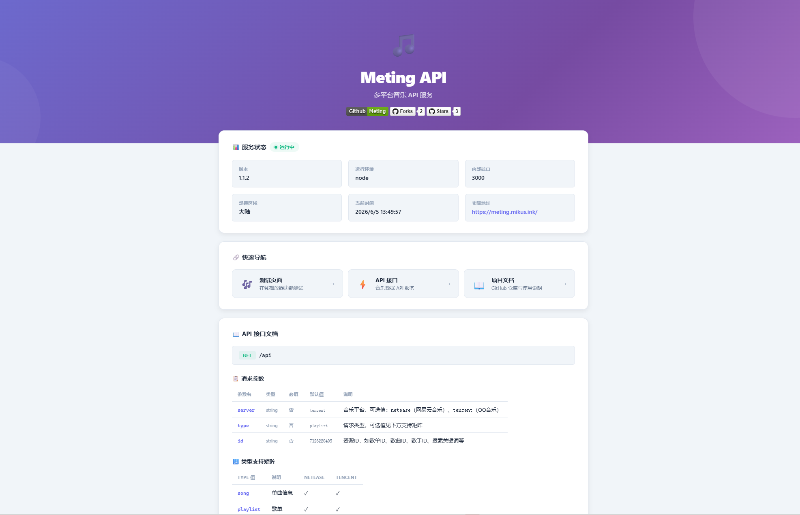
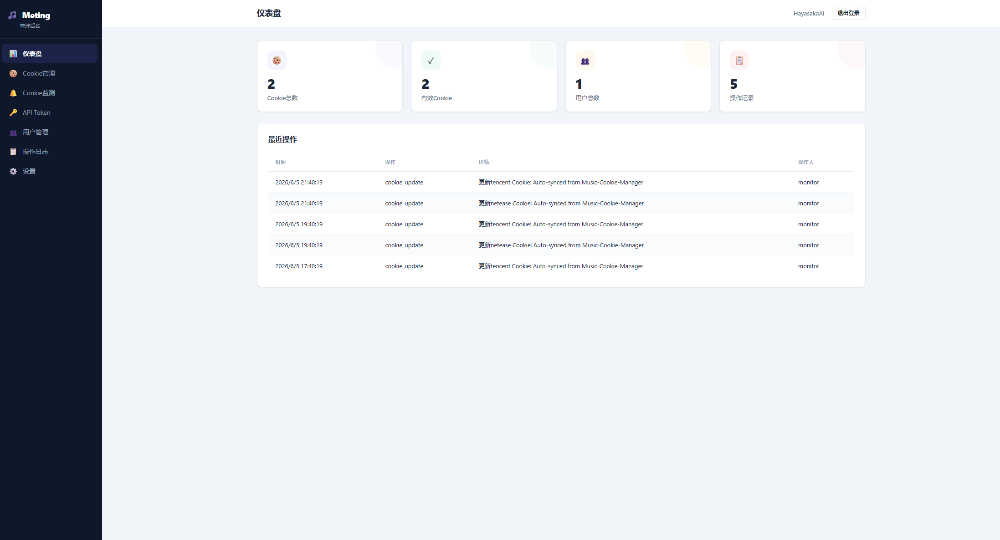

# Meting-API - 多平台音乐 API 服务

## 项目简介
::github{repo="mikus-loli/Meting-API"}
Meting-API 是一个开源的多平台音乐 API 服务，由 mikus-loli 开发维护。该项目 fork 自 xizeyoupan/Meting-API，并在此基础上进行了大量功能增强和优化。它支持网易云音乐和 QQ 音乐两大主流音乐平台，提供了完整的 Cookie 管理系统、VIP 歌曲播放能力、自动续期机制以及完善的监测通知功能。

## 界面截图


## 核心功能特性

### 双平台支持

Meting-API 同时支持网易云音乐和 QQ 音乐两大平台，为开发者提供了统一的音乐 API 接口。无论是获取歌曲信息、播放链接、歌词还是封面图片，都可以通过一致的 API 格式进行调用。

### 完善的 Cookie 管理系统

项目提供了功能完备的 Cookie 管理功能：

- **增删改查**：支持 Cookie 的完整生命周期管理
- **在线验证**：实时检测 Cookie 的有效性
- **VIP 播放能力检测**：自动识别 Cookie 是否具有 VIP 播放权限
- **QQ音乐自动刷新**：支持 musickey 和 refresh_token 两种续期方式

### Cookie 定时监测

系统内置了定时监测功能，可以：

- 配置 5 分钟到 24 小时的检查间隔
- 自动检测 Cookie 失效情况
- 监测 VIP 播放能力是否丢失
- 失效或 VIP 丢失时自动发送通知

### Webhook 通知系统

支持多种主流通知渠道：

- Gotify（推荐）
- 企业微信
- 钉钉
- 飞书

通知系统支持自定义消息格式和优先级设置，确保重要信息能够及时送达。

### 安全特性

项目内置了多重安全机制：

- **登录失败锁定**：连续 5 次失败后锁定 15 分钟
- **隐藏管理入口**：通过 `ADMIN_PATH` 自定义后台路径
- **动态路径修改**：管理员可在后台设置页面修改路径
- **2FA 双因素认证**：TOTP 实现，兼容 Google Authenticator / Authy
- **非 root 运行**：Docker 容器以 `meting` 用户运行，提升安全性

### 管理后台

提供了一个功能完备的单页应用管理后台，具有响应式设计：

- **仪表盘**：Cookie 统计、有效 Cookie 数、用户数、操作记录
- **Cookie 管理**：增删改查、在线验证、QQ音乐刷新、获取教程
- **Cookie 监测**：定时检查、自动刷新、Webhook 通知、监测历史
- **用户管理**：增删改查、角色分配（管理员专属）
- **操作日志**：所有操作记录查看
- **设置**：个人资料、密码修改、后台路径修改、2FA 设置

## API 支持矩阵

| 类型 | 说明 | 网易云 (`netease`) | QQ音乐 (`tencent`) |
|------|------|-------------------|-------------------|
| `song` | 单曲信息 | ✅ | ✅ |
| `playlist` | 歌单 | ✅ | ✅ |
| `artist` | 歌手歌曲 | ✅ | ❌ |
| `search` | 搜索 | ✅ | ❌ |
| `url` | 播放链接 | ✅ | ✅ |
| `lrc` | 歌词 | ✅ | ✅ |
| `pic` | 封面图片 | ✅ | ✅ |

## 地区限制说明

### 部署在国外服务器

| 客户端访问地区 | 国内 | 国外 |
|---------------|------|------|
| 网易云 | ✅ | ✅ |
| QQ音乐 | ✅¹ | ❌ |

### 部署在国内服务器

| 客户端访问地区 | 国内 | 国外 |
|---------------|------|------|
| 网易云 | ✅ | ✅ |
| QQ音乐 | ✅ | ❌ |


## Docker 部署

```bash
services:
  meting:
    image: ghcr.docker.mikus.ink/mikus-loli/meting-api:latest #默认使用mikus的加速源
    container_name: meting
    volumes:
      - ./data:/app/data
    ports:
      - 3000:3000
    restart: always
    networks:
      - 1panel-network
networks:
  1panel-network:
    external: true
# 默认账号密码：admin / admin123，请登录后立即修改默认密码。
```


## 环境变量配置

| 变量 | 默认值 | 说明 |
|------|--------|------|
| `PORT` | `3000` | 服务监听端口 |
| `OVERSEAS` | `false` | 海外模式。Vercel/Cloudflare 运行时自动设为 `true` |
| `ADMIN_PATH` | `admin` | 管理后台路径。如设为 `secret-admin`，则后台地址为 `/secret-admin` |
| `DATA_DIR` | `./data` | 数据存储目录 |
| `UID` | `1010` | Docker 容器用户 UID |
| `GID` | `1010` | Docker 容器用户 GID |

## 使用方法

### 前端插件集成

在导入 MetingJS 前添加：

```html
<script>
var meting_api='http://your-domain/api?server=:server&type=:type&id=:id&auth=:auth&r=:r';
</script>
```

### API 请求示例

```bash
# 获取歌单
GET /api?server=netease&type=playlist&id=7326220405

# 获取单曲信息
GET /api?server=tencent&type=song&id=004Yi5BD3ksoAN

# 获取播放链接
GET /api?server=netease&type=url&id=22704470

# 获取歌词
GET /api?server=tencent&type=lrc&id=004Yi5BD3ksoAN
```

### 响应格式

- `type=url`：以 `@` 开头返回纯文本，否则 302 重定向到音频 URL
- `type=pic`：302 重定向到图片 URL
- `type=lrc`：返回纯文本歌词（含翻译合并）
- 其他类型：返回 JSON 数组

## Cookie 获取方法

### 网易云音乐

1. 登录 [music.163.com](https://music.163.com/)
2. 按 F12 打开开发者工具
3. 切换到 Network 标签，刷新页面
4. 找到任意请求，复制请求头中的 Cookie 字段
5. 粘贴到管理后台的 Cookie 输入框
6. 建议配合[Music-Cookie](https://github.com/mikus-loli/Music-Cookie)

### QQ音乐

1. 登录 [y.qq.com](https://y.qq.com/)
2. 按 F12 打开开发者工具
3. 切换到 Application → Cookies → y.qq.com
4. 复制 `uin` 和 `qqmusic_key` 的值
5. 格式：`uin=你的uin; qqmusic_key=你的key`
6. 建议配合[Music-Cookie](https://github.com/mikus-loli/Music-Cookie)

**提示**：QQ音乐的完整 Cookie（包含 `psrf_qqrefresh_token`）支持自动续期，建议复制所有字段。

## QQ音乐 Cookie 自动续期

系统支持 QQ音乐 Cookie 自动刷新，无需手动更新：

- **刷新方式**：优先使用 `refresh_token`，失败后回退到 `musickey`
- **触发条件**：Cookie 监测检测到 VIP 播放能力丢失时自动触发
- **手动刷新**：在 Cookie 管理页面点击「刷新」按钮
- **刷新后更新**：`qqmusic_key`、`qm_keyst`、`access_token`、`openid`、过期时间等字段

## Cookie 监测系统

### 功能特性

- 定时监测 Cookie 有效性（间隔 5 分钟 ~ 24 小时）
- 检测 VIP 播放能力丢失
- QQ音乐 Cookie 自动刷新续期
- Webhook 通知（Cookie 失效、VIP 丢失、刷新成功）

### 配置步骤

1. 登录管理后台 → Cookie 监测
2. 启用定时监测，设置检查间隔
3. 配置 Webhook 通知（可选）
4. 保存设置

### Webhook 消息格式

```json
{
  "title": "Cookie失效通知 - 网易云音乐",
  "message": "平台: 网易云音乐\n备注: VIP账号\n失效时间: 2024-01-15 18:30:00\n原因: Cookie已失效\n\n请及时更新Cookie以确保服务正常",
  "priority": 5
}
```

### 通知事件优先级

| 事件 | 优先级 |
|------|--------|
| Cookie 失效 | 5 |
| VIP 播放能力丢失 | 4 |
| Cookie 自动刷新成功 | 3 |


## 常见问题

### QQ音乐无法播放？

- 确认部署在国内服务器
- 确认添加了有效的 VIP Cookie
- 尝试使用包含 `psrf_qqrefresh_token` 的完整 Cookie 以支持自动续期

### Cookie 刷新失败？

- 检查 Cookie 是否已完全过期（超过 90 天）
- 尝试重新登录获取新 Cookie
- 确保 Cookie 中包含 `psrf_qqrefresh_token` 字段

### Docker 数据持久化？

使用 `-v` 挂载数据目录：

```bash
docker run -d -p 3000:3000 -v ./data:/app/data ghcr.io/mikus-loli/meting-api:latest
```

### 忘记管理后台路径？

检查 `DATA_DIR/config.json` 中的 `adminPath` 字段，或通过环境变量 `ADMIN_PATH` 重新指定。

## 相关项目

- [MetingJS](https://github.com/xizeyoupan/MetingJS) - 前端音乐播放插件
- [Hono](https://github.com/honojs/hono) - Web 框架
- [NeteaseCloudMusicApi](https://github.com/Binaryify/NeteaseCloudMusicApi) - 网易云音乐 API
- [QQMusicApi](https://github.com/jsososo/QQMusicApi) - QQ 音乐 API


## 开源协议

该项目采用 MIT 协议开源，用户可以自由使用、修改和分发。

