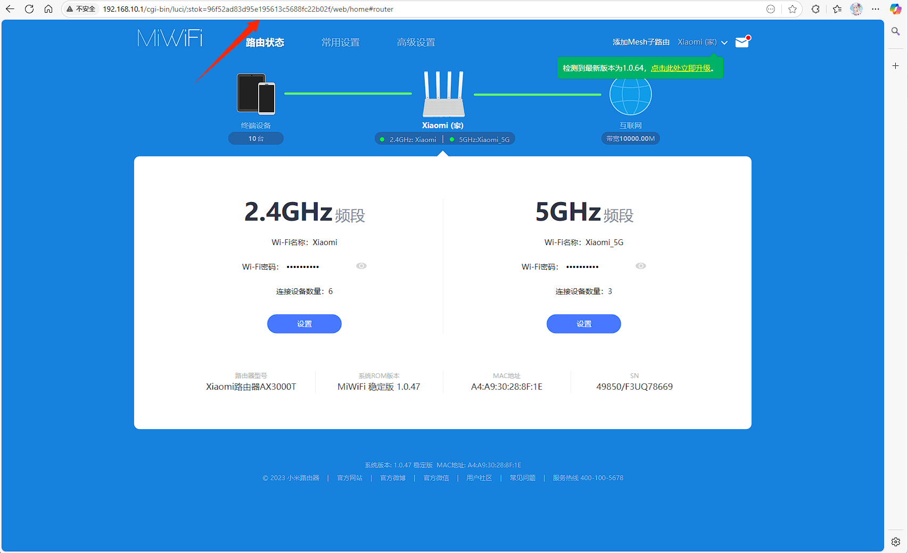

# 小米 AX3000T 开启 SSH 功能
## 方案一
### 1.开启ssh
:::caution[注意]
系统版本需不高于 1.0.47，高于此版本需使用官方工具降级。新生产的小米 AX3000T 似乎更换了硬件，降级系统会变砖，请看方案二。
:::

1. 登录小米路由器后台，复制自己的 stok 变量，如上图 stok 值为 96f52ad83d95e195613c5688fc22b02f。
2. 在 Windows 系统中按 Win+R 打开运行窗口，输入 cmd 打开终端。
3. 依次输入以下四条命令，解锁 SSH（请将 stok 和 IP 地址替换为你浏览器地址栏中看到的实际值）：
:::caution[注意]
192.168.10.1 是路由器 IP 地址，小米默认 IP 为 192.168.31.1。stok 的值请记得替换为你的实际值。
:::
```bash
curl -X POST http://192.168.10.1/cgi-bin/luci/;stok=0a53ad5b8027c954d73b12ba8622668e/api/misystem/arn_switch -d "open=1&model=1&level=%0Anvram%20set%20ssh_en%3D1%0A"
```
```bash
curl -X POST http://192.168.10.1/cgi-bin/luci/;stok=0a53ad5b8027c954d73b12ba8622668e/api/misystem/arn_switch -d "open=1&model=1&level=%0Anvram%20commit%0A"
```
```bash
curl -X POST http://192.168.10.1/cgi-bin/luci/;stok=0a53ad5b8027c954d73b12ba8622668e/api/misystem/arn_switch -d "open=1&model=1&level=%0Ased%20-i%20's%2Fchannel%3D.*%2Fchannel%3D%22debug%22%2Fg'%20%2Fetc%2Finit.d%2Fdropbear%0A"
```
```bash
curl -X POST http://192.168.10.1/cgi-bin/luci/;stok=0a53ad5b8027c954d73b12ba8622668e/api/misystem/arn_switch -d "open=1&model=1&level=%0A%2Fetc%2Finit.d%2Fdropbear%20start%0A"
```
正常情况下每条结果都会返回 "code": 0，表示解锁 SSH 成功。如未固化 SSH，重启路由器后可能会丢失 SSH 连接。
### 2.计算 SSH 密码
访问 https://miwifi.dev/ssh，输入路由器的 SN 号即可获取 SSH 密码（SN 号可在路由器后台查看）。
### 3.固化 SSH
:::caution[注意]
固化 SSH 后，重启系统不会丢失 SSH 连接。
:::
小米路由器采用 Snapshot 系统，重启后会恢复为初始状态，导致解锁的 SSH 失效（提示：connect to host 192.168.10.1 port 22: Connection refused）。
固化 SSH 比较麻烦，可以使用 lemoeo/AX6S 的开机自启脚本来实现重启后自动开启 SSH 服务。
::github{repo="lemoeo/AX6S"}
```bash
1. 创建目录
mkdir /data/auto_ssh && cd /data/auto_ssh
2. 下载脚本 
# GitHub 地址
curl -kfsSL -O https://raw.githubusercontent.com/lemoeo/AX6S/main/auto_ssh.sh && chmod +x auto_ssh.sh
# jsDelivr CDN 地址
curl -kfsSL -O https://cdn.jsdelivr.net/gh/lemoeo/AX6S@main/auto_ssh.sh && chmod +x auto_ssh.sh
3. 执行命令解锁 SSH 并添加开机自启动
./auto_ssh.sh install
4. 如果不需要自动开启 SSH 服务，使用命令移除开机自启动
./auto_ssh.sh uninstall
```
# 方案二
::github{repo="openwrt-xiaomi/xmir-patcher"}
1. 下载 xmir-patcher
2. 将路由器恢复出厂设置，完成初始化配置。解压 xmir-patcher，Windows 运行 run.bat，Linux 运行 run.sh。
3. 设置路由器 IP，选择【1】，输入路由器的 IP 地址（小米路由器默认 192.168.31.1）。
4. 解锁 SSH，选择【2】，输入路由器后台管理密码，提交后会显示开启状态。
5. 修改 root 密码，选择【8】，再选择【2】修改 root 密码。
6. 固化 SSH，选择【8】，再选择【7】固化 SSH。
7. 使用 SSH 工具连接到终端，出现 Banner "ARE U OK" 则表示成功。
